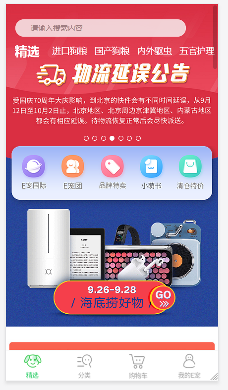
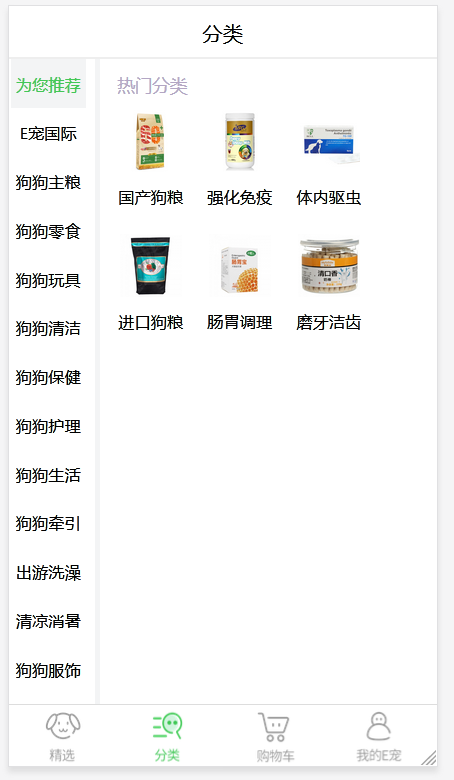
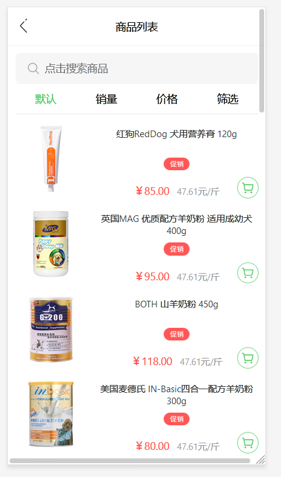
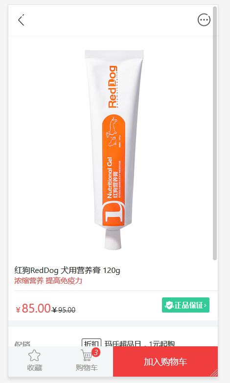
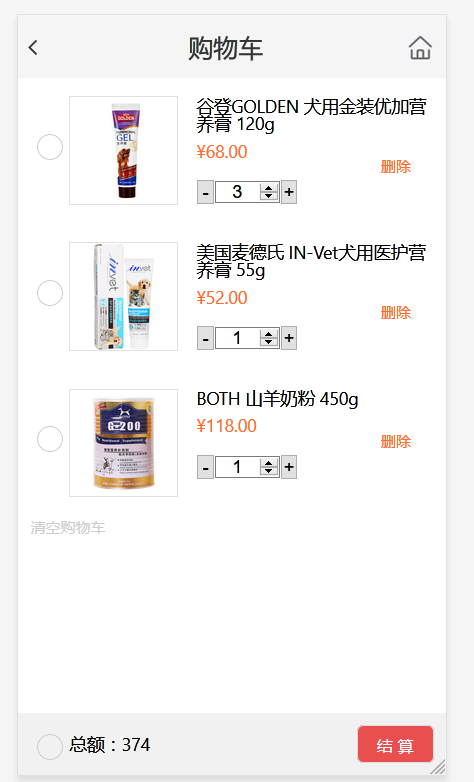

# 项目分工说明

## 项目名称：e宠商城

## 项目目录说明

- **首页，详情页，列表页，购物车，登录注册，用户信息**
- 移动端页面**github**地址：<https://github.com/gzh51906/Epet>
- 后端管理系统**github**地址：<https://github.com/gzh51906/EpetK>
- 移动端上线地址：[http://47.104.103.240:1906](http://47.104.103.240:1906/)
- 官网：<https://wap.epet.com/app/>

## 团队成员

- 组长：刘钦博，组员：罗诗华，蒋宽，兰青

- ### 负责模块

  ##### 每个人都是页面加功能

- 刘钦博：**首页，购物车**

- 罗诗华：**详情页，分类页**

- 蒋宽：**登录注册，我的页面**

- 兰青：**后端管理系统**

## 项目页面截图

## tree 树

|-- README.md

|-- config-overrides.js

|-- goodslist.json
|-- package-lock.json
|-- package.json
|-- public
|   |-- api
|   |   |-- categorys
|   |   |   |-- 1.json
|   |   |   |-- 10.json
|   |   |   |-- 11.json
|   |   |   |-- 12.json
|   |   |   |-- 13.json
|   |   |   |-- 14.json
|   |   |   |-- 2.json
|   |   |   |-- 3.json
|   |   |   |-- 4.json
|   |   |   |-- 5.json
|   |   |   |-- 6.json
|   |   |   |-- 7.json
|   |   |   |-- 8.json
|   |   |   |-- 9.json
|   |   |   `-- index.json
|   |   |-- dingdan.json
|   |   |-- mine.json
|   |   `-- randomz.json
|   |-- favicon.ico
|   |-- index.html
|   |-- logo192.png
|   |-- logo512.png
|   |-- manifest.json
|   `-- robots.txt
`-- src
    |-- App.css
    |-- App.js
    |-- App.test.js
    |-- axios
    |   `-- index.js
    |-- http.js
    |-- images
    |   `-- nav.png
    |-- index.css
    |-- index.js
    |-- logo.svg
    |-- pages
    |   |-- Cart.js
    |   |-- Details.js
    |   |-- Goodslistl.js
    |   |-- Home.js
    |   |-- List
    |   |   |-- component
    |   |   |   |-- categorys.css
    |   |   |   |-- categorys.js
    |   |   |   |-- show.css
    |   |   |   `-- show.js
    |   |   |-- index.js
    |   |   `-- store
    |   |       |-- actiontype.js
    |   |       |-- createaction.js
    |   |       |-- index.js
    |   |       `-- reducer.js
    |   |-- Mine
    |   |   |-- benner.jpg
    |   |   |-- body.jpg
    |   |   |-- component
    |   |   |   `-- box.jsx
    |   |   |-- img.jsx
    |   |   |-- index.jsx
    |   |   |-- msg.png
    |   |   |-- set.png
    |   |   `-- store
    |   |       |-- actiontype.js
    |   |       |-- createaction.js
    |   |       |-- index.js
    |   |       `-- reducer.js
    |   |-- Notfound.js
    |   |-- Tabbar.js
    |   |-- goodslist
    |   |   `-- index.js
    |   |-- goodsstore
    |   |   `-- index.js
    |   |-- login
    |   |   |-- bg.jpg
    |   |   `-- index.js
    |   `-- reg
    |       |-- bg.jpg
    |       `-- index.js
    |-- redux
    |   |-- common
    |   |   |-- actiontype.js
    |   |   |-- createaction.js
    |   |   |-- index.js
    |   |   `-- reducer.js
    |   `-- index.js
    |-- serviceWorker.js
    `-- style
        |-- base.css
        |-- cart.css
        |-- details.css
        |-- goodslist.css
        `-- home.css